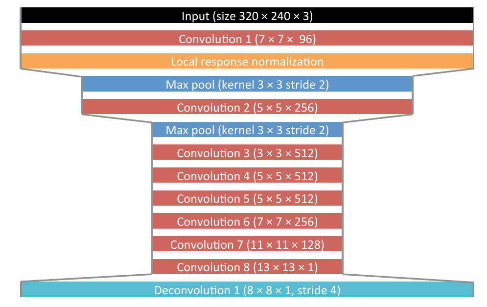
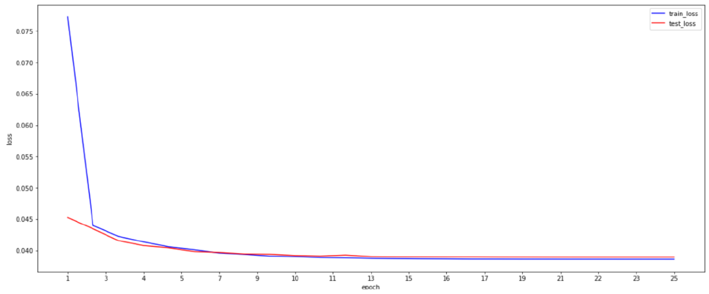
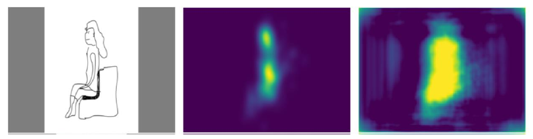
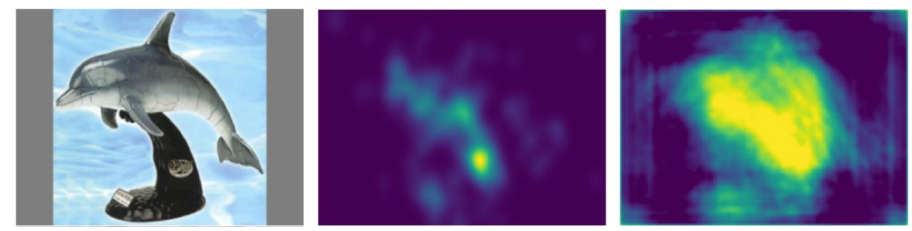
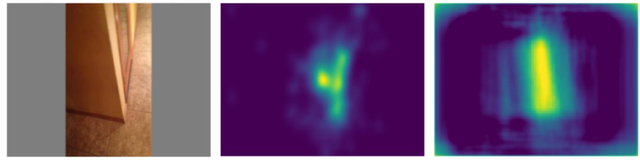

# Saliency Map Prediction in Deep Learning

Saliency map prediction in deep learning is a technique that aims to identify the most important or salient features in an input image or video. It is a type of visual attention mechanism that can be used to identify the most relevant parts of an image or video for downstream tasks such as object recognition, segmentation, or tracking.

## Steps Involved in Saliency Map Prediction

The process of saliency map prediction typically involves the following steps:

1. **Input preprocessing:** The input image or video is preprocessed to normalize the pixel values and/or resize the image to a fixed size.
2. **Feature extraction:** The deep neural network extracts high-level features from the input image or video using convolutional layers.
3. **Saliency map generation:** The saliency map is generated by applying a set of operations to the features extracted by the convolutional layers. These operations can include pooling, upsampling, and convolutional layers with learnable weights.
4. **Postprocessing:** The saliency map may be postprocessed to smooth the heat map, threshold it to remove noise, or combine it with other information such as object proposals or motion vectors.

## Types of Deep Neural Networks for Saliency Map Prediction

There are various types of deep neural networks that can be used for saliency map prediction, including:

- Fully convolutional networks
- Recurrent neural networks
- Attention-based models

These models can be trained using supervised learning with annotated saliency maps or unsupervised learning with self-supervised or reinforcement learning techniques.

## Applications of Saliency Map Prediction

Saliency map prediction has many applications in computer vision, including:

- Object detection
- Image segmentation
- Visual tracking
- Image captioning

It can also be used for human-robot interaction, where the robot can use the saliency map to focus on the most relevant parts of the environment for a given task.

# Dataset
The "CAT2000" dataset, also known as the "Caltech 2000" dataset, is a large image classification dataset commonly used in computer vision research. It was created by researchers at the California Institute of Technology (Caltech) and consists of 2,000 images across 8 different categories: airplanes, cars, birds, cats, deer, dogs, frogs, and horses.

Each category contains 250 images, and the images are of varying resolutions and sizes. The images were collected from various sources, including web searches, and are intended to be representative of real-world images rather than carefully curated examples.

The CAT2000 dataset is often used as a benchmark for evaluating the performance of image classification algorithms and models. It is a popular dataset for training and testing deep learning models, and has been used in many research papers over the years.

# Model architecture

The model we will be using is Deep ConvNet, and you can see its architecture in the figure below[1]. 

# Training parameters
The table presented below displays the parameters that were used during the model training process.

| Parameter | Value |
|:---------:|:------:|
| Normalize input | Mean = 0.5   Std = 0.5|
| Input Size | (240,320) |
| Output size | (236,316) |
| Train batch size | 2 |
| Test batch size | 2 |
| Percentage of test data | 15% |
| Convolutional layer initialization | He(Nonlinearity=ReLu) |
| CnvTranspose2D | Normal(Mean=0 , std=10e-5) |
| Optimizer | SGD |
| Loss function | MSE |
| Momentum | 0.9 |
| Weight decay | 4e-6 |
| Nestrov | False |
| Activation function | ReLu |
| Learning rate | 1e-3 |
| Epochs | 25 |

# Loss
The figure below shows the Mean Squared Error (MSE) loss of the model over the course of 25 epochs. MSE is a common loss function used in machine learning to measure the difference between the predicted values and the actual values. A lower MSE indicates better performance, as it means the predicted values are closer to the actual values. By tracking the MSE loss over time, we can evaluate how well the model is learning from the training data and identify any issues that may need to be addressed. In this case, the figure provides a visual representation of how the model's performance changes over the course of 25 epochs."

# Samples
The output of the trained model is displayed below, showcasing its ability to predict saliency maps. The image on the left serves as the input to the model, which takes this image as an input and processes it to predict a saliency map. The middle image is the ground truth, representing the expected output for the input image. Finally, the image on the right is the predicted saliency map, produced by the trained model.
> ## Sample 1

> ## Sample 2

> ## Sample 3

> ## Sample 4

# Refrence
1. https://openaccess.thecvf.com/content_cvpr_2016/papers/Pan_Shallow_and_Deep_CVPR_2016_paper.pdf
